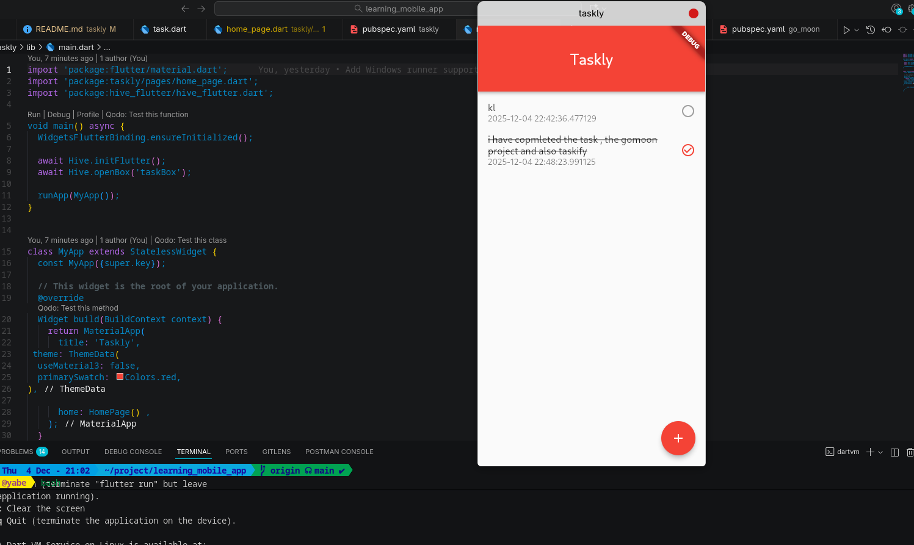
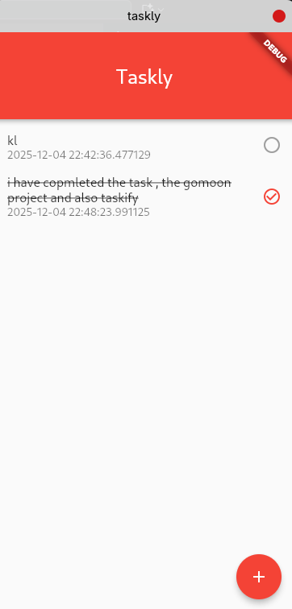

# **Taskly — Simple Task Manager (Flutter + Hive)**

Taskly is a lightweight task-tracking mobile application built with **Flutter** and **Hive**.
The goal of this project was to practice core Flutter concepts such as UI building, state management, local storage, and widget interaction.

---

## 🚀 **Features**

### ✔️ **Stateful Widgets**

* Built the main screen using `StatefulWidget` to handle dynamic data.
* Learned how `setState()` updates the UI instantly.

### ✔️ **AppBar**

* Added a responsive AppBar with custom height.
* Centered title “Taskly” with Material styling.

### ✔️ **Floating Action Button**

* Used a FAB to let users add new tasks.
* Triggered a popup dialog to enter task content.

### ✔️ **Dialogs for User Input**

* Implemented `AlertDialog` containing a `TextField`.
* Captured user input and saved it to local storage.

### ✔️ **ListView + ListTiles**

* Displayed tasks using `ListView.builder`.
* Tapping a task toggles completion.
* Long-press deletes a task.

### ✔️ **Models**

* Created a `Task` model with:

  * content
  * timestamp
  * done (boolean)
* Converted tasks to/from maps for Hive storage.

### ✔️ **Local Storage with Hive**

* Initialised Hive with `Hive.initFlutter()`.
* Opened a box to store tasks permanently.
* Added, updated, and deleted records using Hive API.

### ✔️ **Asynchronous Programming**

* Learned to work with:

  * `Future`
  * `async/await`
  * loading UI while boxes initialize

---

## 📱 **Screenshots**

Below is an example of how Taskly looks (based on your screenshot):

* Clean white/pinkish background
* Centered “Taskly” title
* Floating Action Button in the bottom-right
* Tasks appear in a simple list when added





---

## 🛠 **Tech Stack**

| Technology                  | Purpose                       |
| --------------------------- | ----------------------------- |
| **Flutter**                 | UI, navigation, widget system |
| **Dart**                    | Application logic             |
| **Hive**                    | Lightweight local storage     |
| **Material 3 / Material 2** | Theming and UI components     |

---

## 📦 **Folder Structure**

```
lib/
 ├─ models/
 │   └─ task.dart
 ├─ pages/
 │   └─ home_page.dart
 └─ main.dart
```

---

## 📝 **What I Learned**

This project helped me understand:

* How **Stateful Widgets** work
* How the **widget tree** rebuilds
* Using **MediaQuery** for responsive layouts
* Building a UI with **AppBar**, **ListView**, **FAB**, **Dialogs**
* Making classes reusable by creating **models**
* Working with **asynchronous operations**
* Using **Hive** to store data locally
* Debugging null-safety errors
* The difference between **Material 2 (primarySwatch)** and **Material 3 (ColorScheme)**

---

## ▶️ **How to Run**

```bash
flutter pub get
flutter run
```

